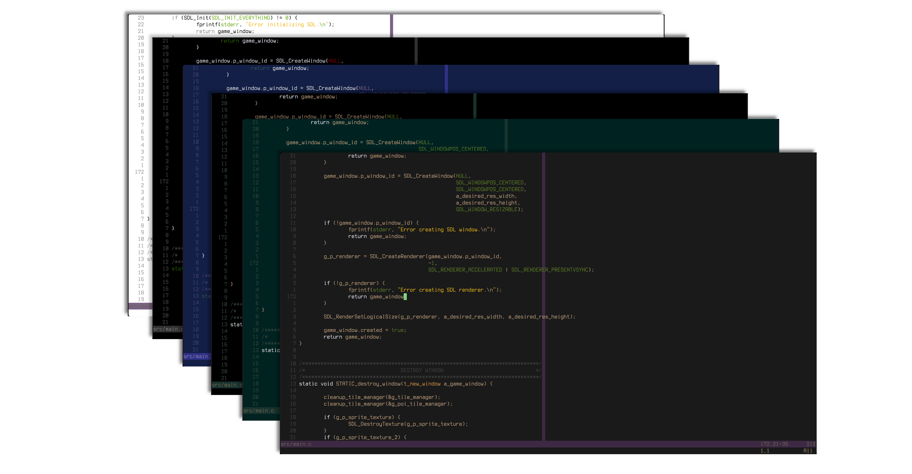

# Owl Zen
Owl zen is a set of simple minimalistic colour schemes for vim/neovim created with one simple concept. Less colour is better. I find colour to be very distracting and therefore always find it hard to pick a coluorscheme, so I started working on my own. This is a side project I sometimes work on.

